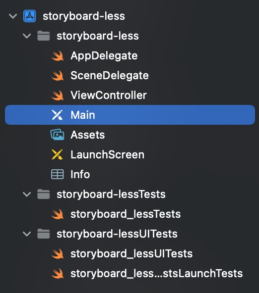

# storyboard-less
Creating an Xcode project without a storyboard

I never liked to use Xcode Interface Builder. It is a great tool for learning and I am sure a lot of developers find it an excellent tool to build their APPS. 

This is just my personal choice. I like to (think) I control, as much as possible, what my code is doing (the reality is has many points of view).

Not following Apple path of using Storyboards might have some undesired consequences. However, not even one of the APPS that I have put on the APP store has used Storyboards (and I did work on some complex ones), so this not a hard limitation.

Do not follow these steps on and exiting Xcode project, use them only when creating a blank project from scratch.

This guide has been updated to Xcode Version 14.2.

- Create a new iOS APP Project


- Delete Main.storyboard file



- Delete Storyboard name from Info.plist


- Delete Storyboard name from Target -> Info


We should be ready and free to start our little APP our own way.

First let's just have the ViewController do something so that we know that we were successful

We will just change the background color by editing ViewController.swift

```
    override func viewDidLoad() {
        super.viewDidLoad()
        // Do any additional setup after loading the view.
        
        view.backgroundColor = UIColor.yellow
    }
```

Next we need to create and show our ViewController.

We do this by modifying the SceneDelegate file

```
    func scene(_ scene: UIScene, willConnectTo session: UISceneSession, options connectionOptions: UIScene.ConnectionOptions) {
        // Use this method to optionally configure and attach the UIWindow `window` to the provided UIWindowScene `scene`.
        // If using a storyboard, the `window` property will automatically be initialized and attached to the scene.
        // This delegate does not imply the connecting scene or session are new (see `application:configurationForConnectingSceneSession` instead).
        
        guard let windowScene = (scene as? UIWindowScene) else { return }
              
        window = UIWindow(windowScene: windowScene)
        window?.rootViewController = ViewController() // Your initial view controller.
        window?.makeKeyAndVisible()

    }
```

We can now run our APP and view the Yellow color of success:


Free as a bird!
